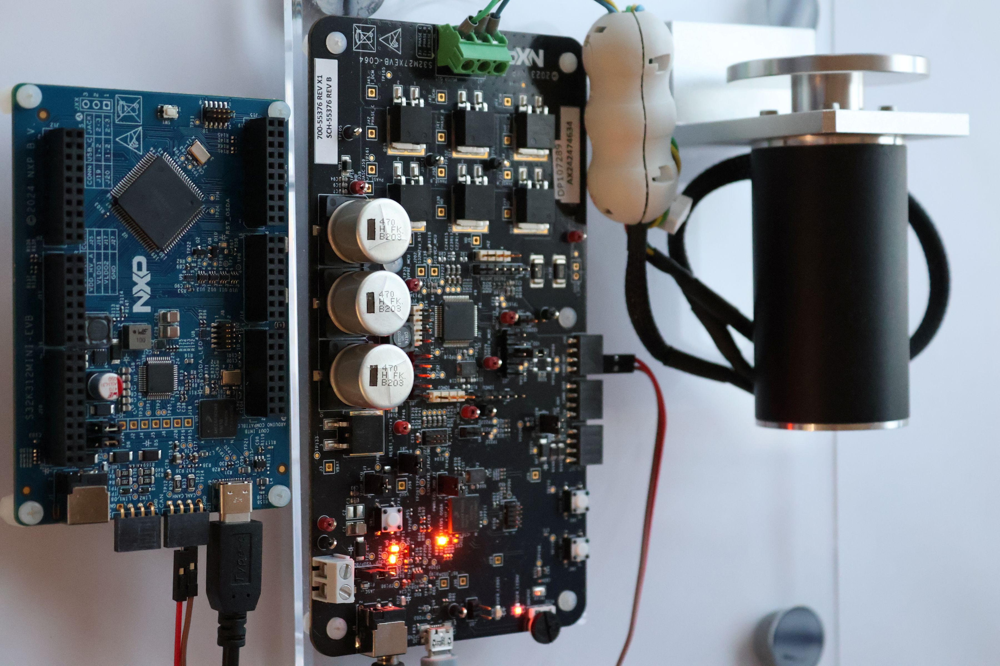
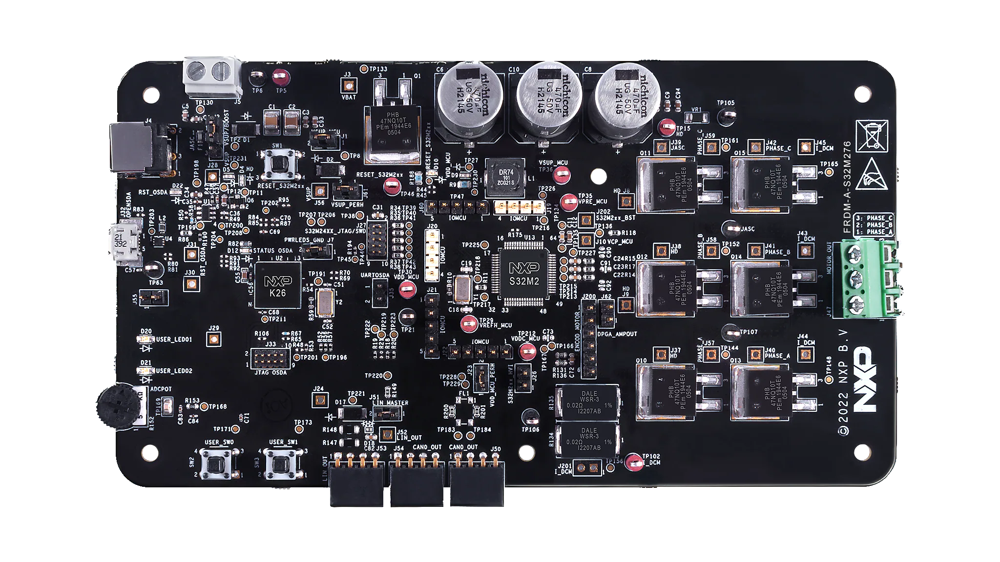
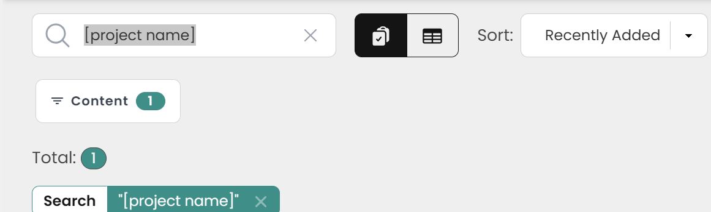
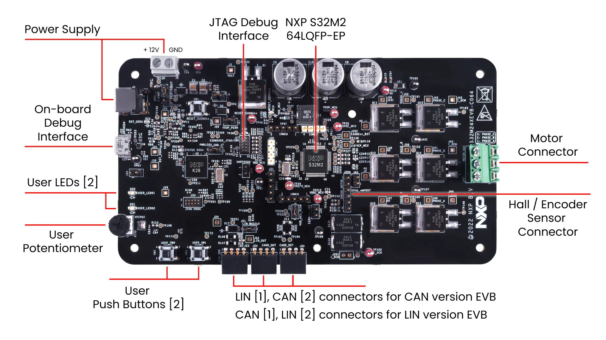
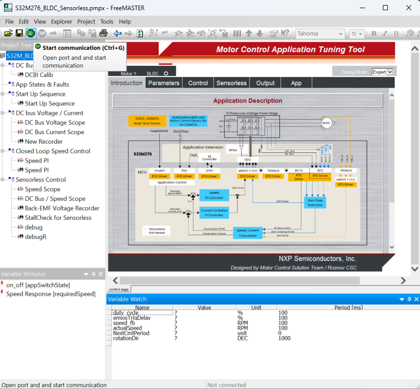
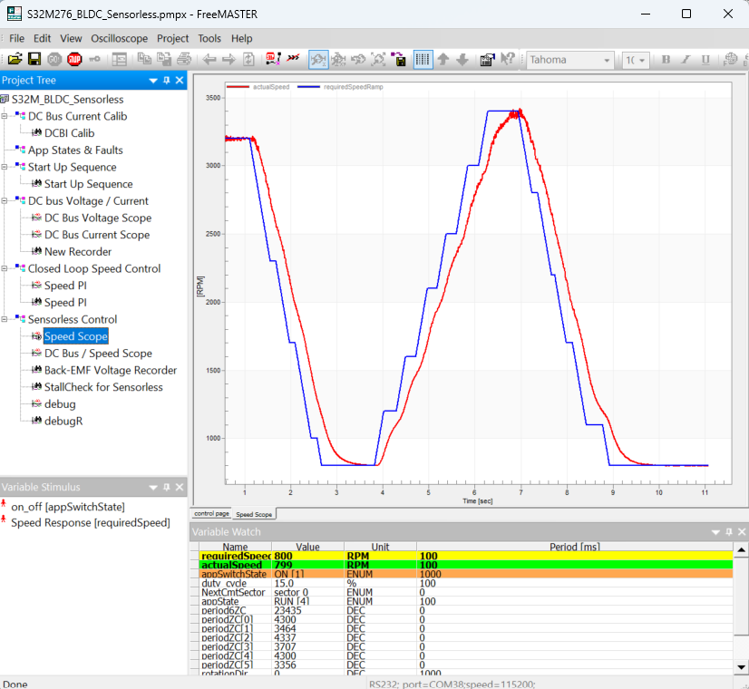
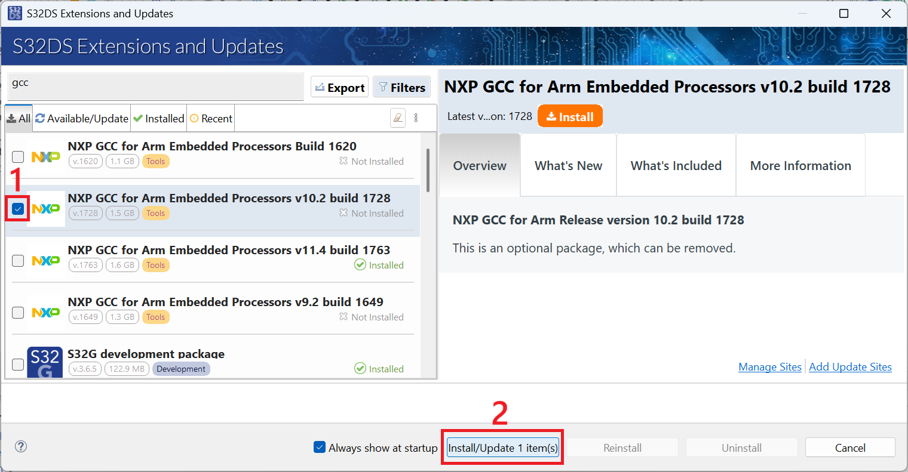
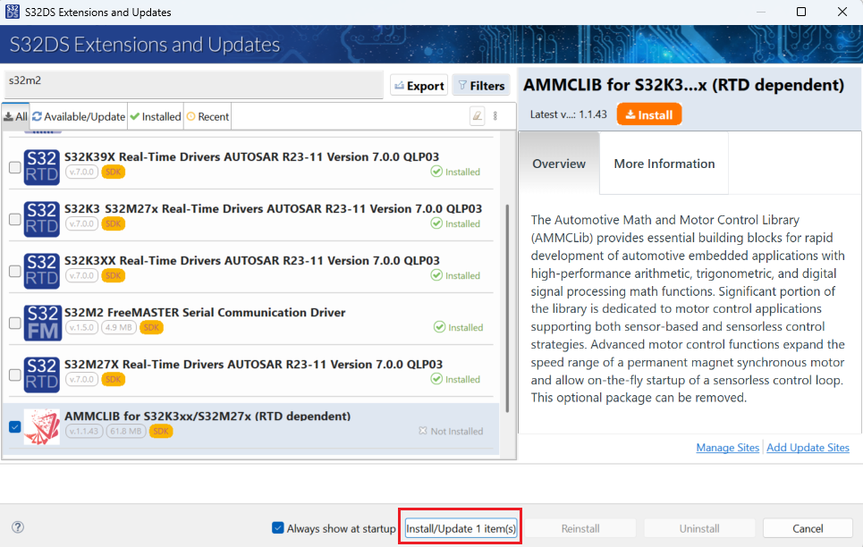

# NXP Application Code Hub
[](https://www.nxp.com)

## Motor Control Using a CAN gateway between FRDM-A-S32K312 and FRDM-A-S32M276
This project implements an BLDC Motor Control example using FRDM-A-S32M276 and FRDM-A-S32K312 boards connected through a CAN (Controller Area Network) bus. The FRDM-A-S32K312 board operates as the primary controller, handling high‑level CAN commands, such as speed control. The FRDM-A-S32M276 board functions as a dedicated Motor Control unit, responsible for executing real‑time motor‑drive algorithms such as PWM generation, current regulation, and feedback processing for [Sensorless 6-step BLDC motor control](<https://community.nxp.com/t5/S32M-Knowledge-Base/S32M276-Sensorless-6-step-BLDC-motor-control/ta-p/2035476>) operation.
The boards communicate through a CAN network, enabling reliable, low‑latency data exchange. The primary controller sends control commands (speed, direction). This architecture improves scalability, modularity, and system safety while allowing independent firmware updates and streamlined debugging.
[<p align="center"></p>](./images/CanGateway.jpg)

#### Boards: FRDM-A-S32K312, FRDM-A-S32M276 
#### Categories: Motor Control
#### Peripherals: GDU, ADC, AE, BCTU, DPGA, eMIOS, FlexCAN, HVM, LCU, LPSPI, LPUART, LPIT, Siul2, TRGMUX
#### Toolchains: S32 Design Studio IDE

## Table of Contents
1. [Software and Tools](#step1)
2. [Hardware](#step2)
3. [Setup](#step3)
4. [Results](#step4)
5. [FAQs](#step5)
6. [Support](#step6)
7. [Release Notes](#step7)

## 1. Software and Tools<a name="step1"></a>
This example was developed using the FRDM Automotive Bundle for S32K3. To download and install the complete software and tools ecosystem, use the following link:
- [S32K3 FRDM Automotive Board Installation Package](https://www.nxp.com/app-autopackagemgr/automotive-software-package-manager:AUTO-SW-PACKAGE-MANAGER?currentTab=0&selectedDevices=S32K3&applicationVersionID=156)
- [Automotive Math and Motor Control Library (AMMCLib) Rev 1.1.43](#AMMCLib)
- [FreeMASTER Run-Time Debugging Tool](https://www.nxp.com/design/design-center/software/development-software/freemaster-run-time-debugging-tool:FREEMASTER)

## 2. Hardware<a name="step2"></a>
### 2.1 Required Hardware
- Personal Computer
- 12V Power Adapter
- Type-C USB cable
- Micro USB cable
- [BLDC_KIT](https://www.nxp.com/design/design-center/development-boards-and-designs/BLDC-KIT)[<p align="center"></p>](https://www.nxp.com/assets/images/en/dev-board-image/BLDC_KIT-IMG-TOP.jpg)
- [FRDM-A-S32K312](https://www.nxp.com/design/design-center/development-boards-and-designs/FRDM-A-S32K312)[<p align="center"></p>](https://www.nxp.com/assets/images/en/dev-board-image/FRDM-A-S32K312-TOP.jpg)
- [FRDM-A-S32M276](https://www.nxp.com/design/design-center/development-boards-and-designs/S32M27XEVB)[<p align="center"></p>](https://www.nxp.com/assets/images/en/dev-board-image/FRDM-A-S32M276-TOP.png)

### 2.3 Debugger Connections

- Connect the Type-C USB cable to the FRDM-A-S32K312 board for debugging and power
- Connect the Micro USB cable to the FRDM-A-S32M276 board for debugging and FreeMASTER communication
- Power the FRDM-A-S32M276 board using the 12V adapter connected to the power input connector

## 3. Setup<a name="step3"></a>

### 3.1 Import the Project into S32 Design Studio IDE

1. Open S32 Design Studio IDE, in the Dashboard Panel, choose **Import project from Application Code Hub**.
[<p align="center"></p>](./images/import_project_1.png)

2. Found demo you need by searching the name directly. Open the project, click the **GitHub link**, S32 Design Studio IDE will automatically retrieve project attributes then click **Next>**.
[<p align="center"></p>](./images/import_project_2.png)
[<p align="center"></p>](./images/import_project_3.png)

3. Select **main** branch and then click **Next>**.

4. Select your local path for the repo in **Destination->Directory:** window. The S32 Desig Studio IDE will clone the repo into this path, click **Next>**.

5. Select **Import existing Eclipse projects** then click **Next>**.

6. Select the project in this repo (only one project in this repo) then click **Finish**.

### 3.2 Generating, Building and Running the Example
1. In Project Explorer, right-click the project and select **Update Code and Build Project**. This will generate the configuration (Pins, Clocks, Peripherals), update the source code and build the project using the active configuration (e.g. Debug_FLASH). Make sure the build completes successfully and the *.elf file is generated without errors.
[<p align="center"></p>](./images/UpdateCodeAndBuildProject.png)
Press **Yes** in the **SDK Component Management** pop-up window to continue.

2. Go to **Debug** and select **Debug Configurations**. Select **GDB PEMicro Interface Debugging**:
[<p align="center"></p>](./images/DebugConfigurations.png)

    Use the controls to control the program flow.

### 3.3 Connecting the Hardware

- Check the location of User Buttons, LEDs, 12 Vin DC power, micro-USB connector, Motor Phases, Hall connector JP1: [<br><p align="center"></p>](./images/S32M27XEVB-TOP.jpg)
- Connect 12V DC power supply to the board via the 12V power connector.
- Plug the micro-USB cable to the board for debugging and communication.
- Insert the motor phases (A,B,C) to the J47 Motor_Out on the board.

### ⚠️ Safety Warnings
```
IMPORTANT - Read before starting the motor:
- Ensure motor is mechanically secured before testing
- Keep hands and loose clothing away from rotating parts
- Verify correct power supply voltage (12V DC, max current rating)
- Ensure proper ventilation - motors can overheat
- Use emergency stop procedures when testing
- Disconnect power before making hardware changes
- Never exceed motor's rated speed/current specifications
```

## 4. Results<a name="step4"></a>
The example sends CAN speed commands from the FRDM-A-S32K312 to the FRDM-A-S32M276. The FRDM-A-S32M276 receives the CAN commands and adjusts the motor speed.
- Connect 2 wires from FRDM-A-S32K312 CAN_TX and CAN_RX to FRDM-A-S32M276 CAN_TX and CAN_RX respectively.
- Press the user button on FRDM-A-S32K312 to send CAN speed commands (0-100%).
- Motor will start spinning and adjust speed based on received CAN commands.
- Open FreeMASTER_control/S32M276_BLDC_Sensorless.pmpx project file in FreeMASTER.
- Click on **"GO"** button to establish communication with the target board: [<br><p align="center"></p>](./images/FreeMASTER_Connect.png)
- Observe the CAN speed commands from the FRDM-A-S32K312 in real-time on the FreeMASTER: [<br><p align="center"></p>](./images/FreeMASTER_CanSpeed.png)

## 5. FAQ<a name="step5"></a>
### Common Issues and Solutions
```markdown
Does FreeMASTER connect? 
├─ NO → Check USB cable, COM port, firmware loaded
└─ YES → Is "Fault" displayed?
    ├─ YES → Check fault code in FreeMASTER → Faults & Trips tab
    │   ├─ Overcurrent → Reduce current limit, check motor wiring
    │   ├─ Overvoltage/Undervoltage → Check 12V supply is within range
    │   ├─ Ia, Ib or Ic → See Motor Phases connection are correct
    │   └─ Stall → Verify motor shaft is free to rotate
    └─ NO → Check "ON" button pressed, Speed_Required > 0
```

- After loading the project, there is a message "NXP GCC 10.2 compiler not found":
  - Right-click on the project and select **Quick Fix** to install the required compiler: [<br><p align="center"></p>](./images/S32DS_Qfix.png)
  - Alternatively, navigate to **S32DS Extensions and Updates > NXP GCC 10.2 > Install** and add the NXP GCC 10.2 compiler: [<br><p align="center"></p>](./images/S32DS_GCC.png)
- After loading the project, there is a message "Path to collateral manifest does not exist ${S32K3xx_AMMCLIB}"
  - Install AMMCLIB<a name="AMMCLib"></a> from **S32DS Extensions and Updates > AMMCLIB for S32K3xx/S32M27x > Install** [<br><p align="center"></p>](./images/S32DS_AMMCLIB.png)

## 6. Support<a name="step6"></a>
For general technical questions related to NXP microcontrollers, please use the *[NXP Community Forum](https://community.nxp.com/)*.
- [S32M276 - Sensorless 6-step BLDC motor control](<https://community.nxp.com/t5/S32M-Knowledge-Base/S32M276-Sensorless-6-step-BLDC-motor-control/ta-p/2035476>)
#### Project Metadata

<!----- Boards ----->
[]()
[]()

<!----- Peripherals ----->
[]()
[]()
[]()
[]()
[]()
[]()
[]()
[]()
[]()
[]()
[]()
[]()
[]()
[]()

<!----- Toolchains ----->
[](https://mcuxpresso.nxp.com/appcodehub?toolchain=s32_design_studio_ide)

Questions regarding the content/correctness of this example can be entered as Issues within this GitHub repository.

>**Warning**: For more general technical questions regarding NXP Microcontrollers and the difference in expected functionality, enter your questions on the [NXP Community Forum](https://community.nxp.com/)

[](https://www.youtube.com/NXP_Semiconductors)
[](https://www.linkedin.com/company/nxp-semiconductors)
[](https://www.facebook.com/nxpsemi/)
[](https://x.com/NXP)

## 7. Release Notes<a name="step7"></a>
| Version | Description / Update                           | Date                        |
|:-------:|------------------------------------------------|----------------------------:|
| 1.0     | Initial release on Application Code Hub        |February 27<sup>th</sup> 2026|